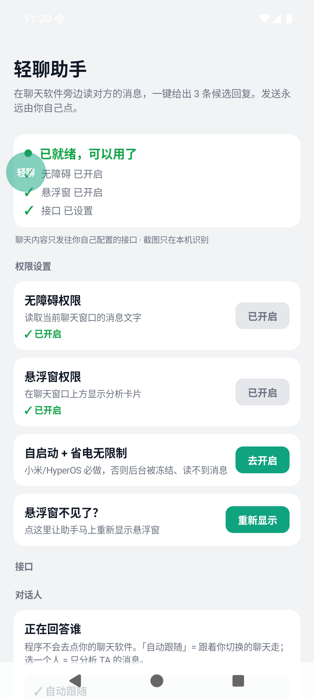
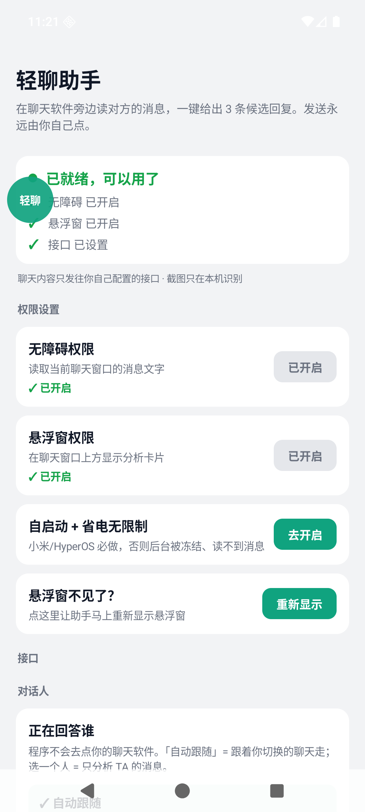

# 轻聊助手（LiteChat）v1.25

**自动找到你的聊天窗口，自动读聊天记录，自动生成 3 条回复，一键填进输入框。**
手机和电脑都有，配置只需要**一个第三方大模型 API**。

> 发送永远由你自己按。程序只把候选回复复制到剪贴板（两端都能一键填进聊天输入框），
> 从不自动点发送，不碰转账红包，不读别的程序的数据。

基于 [Jev 聊天助手](https://github.com/jev-chat/jev-chat-jarvis)（MIT）二次开发的简化版，
详见 [NOTICE](NOTICE)。

**源码仓库**：<https://github.com/xiaoluo139/litechat>

## 下载

不用自己编译，直接下装好的包：

**<https://github.com/xiaoluo139/litechat/releases/latest>**

| 平台 | 下载文件 | 大小 | 系统要求 |
|---|---|---|---|
| 安卓手机 | `LiteChat-Android-v1.25.apk` | 30.9 MB | Android 11+（ARM64 / 32 位 ARM） |
| Windows 电脑（安装版） | `LiteChat-Setup-Windows-v1.25.exe` | 6.6 MB | Windows 10 / 11 · 64 位 |
| Windows 电脑（免安装） | `LiteChat-Windows-portable-v1.25.zip` | 9.2 MB | 解压即用 |

- **安卓**：把 APK 传到手机点安装（需在系统里允许「安装未知来源应用」）。
- **Windows**：双击安装包，装到 `%LOCALAPPDATA%\LiteChat`，**不需要管理员权限**，
  会建桌面和开始菜单快捷方式，可在「设置 → 应用」里卸载。

装完第一次打开，只需要在「接口设置」里填**你自己的大模型 API**（地址 + 密钥 + 模型名），
不用注册、不用登录，也没有内置的服务端。`dist/` 是**自己从源码打包**时生成的位置
（打包脚本见下文「从源码重新打包」），仓库里不存二进制。

## 支持范围（先说清楚边界）

**手机端**

| 项目 | 支持情况 |
|---|---|
| 系统版本 | **Android 11（API 30）及以上**。截屏识别用的是系统给无障碍服务的 `takeScreenshot()`，这个能力从 Android 11 才有，所以 Android 10 及以下**装不上** |
| 处理器 | **ARM64 + 32 位 ARM（armeabi-v7a）** 都已打包，老机器和 Android Go 也能装。x86 不含（只有模拟器和极少数 Intel 平板用） |
| 屏幕 | 任意尺寸、分辨率、DPI。消息区按 dp 换算，**状态栏和导航栏取系统真实高度**——刘海屏、挖孔屏、手势导航都按实机算，不是写死的数字 |
| 深色模式 | 能用。气泡颜色只对"明显绿"下结论，其它颜色一律交回左右位置判断 |
| 分屏 / 小窗 | 能用。截图会记录窗口的偏移和缩放 |
| 横屏 | 消息区会切偏；没有专门适配横屏聊天 |

**电脑端**

| 项目 | 支持情况 |
|---|---|
| 系统 | Windows 10 / 11，**64 位**。Windows 7/8 装不上 |
| 中文识别 | 依赖 **Windows 自带的 OCR**，需要在系统「语言」里装了中文（中文版 Windows 默认就有）。缺了会在面板上直接提示 |
| 屏幕缩放 | 按窗口 DPI 自动换算（100% / 125% / 150% / 200%）——代码是按 DPI 缩放的，但只在 100% 的 1920×1080 上实测过 |
| 多显示器 | 手动框选支持跨屏；自动跟随未在多屏上验证 |
| 聊天软件 | 微信 4.x、微信 3.x、QQ / TIM、飞书、钉钉有专门布局；**其它任何软件**都能一键从窗口列表里选，选一次就记住 |

## 怎么用

### 第一步、填一个接口（30 秒）

打开软件 → 右上角「设置」→ 选一个**服务商预设**（DeepSeek / 通义千问 / 智谱 / Kimi /
硅基流动 / OpenAI / OpenRouter / Claude / Gemini / 本地 Ollama……共 20 个），
把 **API Key** 粘进去，点底部的 **「确认保存」**（这个按钮固定在屏幕底部，不会跑）。

想确认配置对不对，点旁边的「保存并测试连接」，状态行会告诉你结果。

### 电脑版：打开就能用，不用框选

1. 打开微信 / QQ / 飞书电脑版的聊天窗口，再打开轻聊助手。
2. 它会**自己认出聊天窗口**（标题栏显示「采集中」），自动切出消息区、
   自动读聊天记录、自动给出「对方最近说」「建议」「紧张度」和 **3 条候选回复**。
3. 面板默认**跟着聊天窗口走**，停在你旁边。
4. 点某条回复下面的 **「填入聊天框」**，它会聚焦聊天窗口、把这句话打进输入框 ——
   **发送键永远由你按**。也可以点「复制」自己粘。

   控制栏上有一行**技能**按钮：`通用` / `军师`，点一下切换、再点一下取消。

   没自动认出来怎么办？在「当前会话」右边的下拉里选一个窗口就行，**选一次就记住了**，
   下次打开直接用。万一某个软件的版式特殊，还可以「手动框选」兜底。

### 手机版：同样不用手动添加

1. 按首页向导开三项权限：**无障碍**、**悬浮窗**、**自启动 + 省电无限制**
   （小米/HyperOS 必做，否则后台被冻结读不到消息）。
2. 打开任意聊天软件进入聊天窗口。
3. 悬浮球出现，对方发新消息时会自动分析并展开，给出意图、紧张度、建议和 3 条候选回复。
4. 点「复制」或「填入」，然后**你自己按发送**。

   面板顶部有一行**技能**按钮：`通用` / `军师`，点一下切换，点第二下取消。

   识别范围：
   - **QQ / X（推特私信）/ 飞书**：专门适配，直接读节点文字，最准。
   - **其它聊天软件**（钉钉、Telegram、WhatsApp、Slack、Discord、Instagram、
     Messenger、LINE、KakaoTalk、企业微信、TIM……）：内置包名识别 +
     「看着像聊天窗口」的形状判断，**自动读，不用手动添加**。
   - **微信手机版**：微信把消息文字对无障碍隐藏了，所以程序用**截屏 + 本地 OCR** 读
     （设置里有「读取微信」开关，默认开）。截屏是微信风控会注意到的行为，
     不想用就把它关掉，关掉后碰到微信只提示一句、不再截屏。

## 自定义第三方 API：怎么做到「支持所有大模型」

所有大模型 API 的差别只在三种线格式里，程序三种都内置：

| 协议 | 请求形状 | 覆盖的服务商 |
|---|---|---|
| **OpenAI 兼容** | `POST {base}/chat/completions`，`Authorization: Bearer <key>` | OpenAI、DeepSeek、通义千问、智谱 GLM、Kimi、硅基流动、火山方舟、腾讯混元、MiniMax、百川、阶跃、零一万物、OpenRouter、Groq、Ollama、LM Studio、One-API/New-API 中转站……绝大多数服务商 |
| **Anthropic** | `POST {base}/messages`，`x-api-key` + `anthropic-version` | Anthropic Claude 官方 API |
| **Google Gemini** | `POST {base}/models/{model}:generateContent?key=<key>` | Google Gemini 官方 API |

预设只是帮你把**地址 + 协议 + 模型**一次填好；选「自定义（任意兼容服务）」
就能填任意地址。地址栏里直接粘一个完整 URL（`…/chat/completions`、`…/messages`、
`…:generateContent`）也会被原样使用，网关路径再怪也能接。

**temperature 留空就不发送这个参数** —— 避开 o1/o3、DeepSeek-R1 这类直接拒绝该参数的推理模型。
**额外请求头**支持一行一条 `Name: value`，用来对接需要特殊 header 的网关。

> **关于 LongCat**：早先版本里内置过一个 `LongCat 龙猫（美团）` 预设，**现在已经移除**，
> 源码里不再有 `api.longcat.chat` 这个地址。用「自定义」填地址 + 密钥 + 模型即可，功能不变。
> 老配置里如果还记着那个 id，界面会显示成「自定义」并**保留你原来的地址、密钥和模型**。
> （已发布的 v1.25 安装包是在这次移除之前打出来的，里面还带着那个预设；从源码自行构建则不会有。）

## 和原项目比，简化了什么

| | 原版 Jev 聊天助手 | 本简化版 |
|---|---|---|
| 接口配置 | 判断 / 回复 / 视觉三路分别配置 | **一个接口**，地址 + 密钥 + 模型 |
| 模型调用 | 两次：判断模型给结论，生成模型写回复 | **一次**：一个提示词同时返回意图、紧张度和 3 条候选 |
| 协议 | OpenRouter / TypeSafe 专用协议 | **OpenAI 兼容 / Anthropic / Gemini 三协议 + 20 个预设** |
| 电脑端读屏 | 需框选聊天区域 | **自动识别窗口 + 自动切消息区**，另提供一键从窗口列表里选 |
| 重复请求 | — | **只在新的对方消息上问**，抖动/重绘/自己发的消息都不触发 |
| 重新生成时 | — | **已显示的候选不清空**，只更新结果，避免手伸过去时卡片消失 |
| 知识库 | 笔记、联系人、历史三套 | **去掉**，只留一句「关系」说明；另外可选挂上开源的**狗头军师技能**（43 篇参考，按对话内容最多带 2 篇） |
| 技能切换 | — | **通用 / 军师 两个按钮，点一下切换、再点一下取消**，两端位置一致 |
| 平台 | 安卓（+ 各自独立的 mac/Windows 仓库） | **安卓 + Windows**（同一套配置与协议逻辑） |

原版的硬约束一条没丢：不 hook、不注入、不改目标程序、不读其数据库、**绝不自动发送**、
不碰转账红包、密钥不落日志不进 git。

## v1.25 这一版改了什么

**手机端悬浮窗「总是不见 / 点不开」**，三个独立原因：

1. **窗口被系统收走了，程序自己不知道。** MIUI / HyperOS 这类 ROM 会随时把
   `TYPE_APPLICATION_OVERLAY` 窗口摘掉（省电策略、没允许「后台弹出界面」、权限被改回去）。
   以前程序用"我加过一个窗口"当作"窗口还在屏幕上"，于是窗口没了也不会再补回来 ——
   既是"按钮总是不见"，也因为其实不在屏幕上而"点不开"。现在窗口自己报告被摘掉，
   **0.4 秒重挂**，外加 **2 秒自检**兜住没有回调的静默移除；如果刚挂上又被摘走，
   连续 3 次就退避 30 秒并提示去开「后台弹出界面」，而不是每秒跟系统硬抢。
2. **「隐藏助手（本次）」以前是单向门**（删了就再也回不来）。现在叫
   **「隐藏助手 10 分钟」**，到点自己回来；主界面还多了
   **「悬浮窗不见了？→ 重新显示」** 按钮。
3. **白名单没命中不再把浮窗藏起来** —— 名单决定"回答谁"，不该决定"按钮在不在"。

顺带修掉两个会让人觉得"识别不到"的真 bug：

- 判断"这一屏是不是纯黑/被防截屏"用的是 **4×4 网格取样**，正好从两个气泡中间的空隙
  穿过去，把一屏完全能读的聊天判成"受保护窗口"直接放弃。现在 **15×15**。
- 浮窗面板**收起之后**，它上一次的位置仍被当成"自己的 UI"从识别结果里剔掉
  （实测一屏 21 行里丢掉 17 行）。现在只在面板真的展开时才算遮挡区。

实测（Android 14 + Android 16 两个模拟器，同一份代码的 debug 包）：

```
$ python tools/verify_overlay_selfheal.py
bubble on screen: 137x137 at (21,522)
panel opened in 0.0 s (830x1242)          <- 点得开
collapsed back to 137x137
window torn away, app noticed after 0.1 s <- 把窗口从程序底下抽走
came back on its own after 0.1 s (137x137)
overlay self-heal: PASS
```




**没解决的一个外部因素**：如果手机上还有别的悬浮窗应用抢触摸，程序没法阻止它们
截走点按 —— 那属于两个 App 之间的冲突，只能停用其中一个。

## 目录结构

```
litechat/
├─ android/                    安卓工程（Kotlin，传统 View，无 Compose）
│  ├─ app/src/main/java/com/litechat/app/
│  │  ├─ MainActivity.kt        首页：就绪状态 + 权限向导 + 总开关
│  │  ├─ SettingsActivity.kt    设置页 + 底部固定保存栏
│  │  ├─ core/Prefs.kt          唯一的配置存储
│  │  ├─ core/MessageKeys.kt    ★ 判断"是不是新消息"（可单测）
│  │  ├─ core/OverlayLiveness.kt★ 浮窗被系统摘掉后该不该补回来（可单测）
│  │  ├─ llm/LlmPresets.kt      20 个服务商预设 + 三种协议定义
│  │  ├─ llm/Endpoints.kt       ★ 地址拼接（可单测）
│  │  ├─ llm/SuggestionParser.kt★ 模型输出解析（可单测）
│  │  ├─ llm/LlmClient.kt       三协议请求 + 响应解析
│  │  ├─ llm/Skills.kt          ★ 技能（通用 / 狗头军师）+ 参考文档按需挑选
│  │  ├─ llm/HttpJson.kt        HTTP：25s 超时、只重试一次、可中断
│  │  ├─ capture/               无障碍采集 + 通用聊天识别 + 截图 OCR + 输入框回填
│  │  │  ├─ ChatAppAdapter.kt   ★ 各聊天软件的节点规则 + 消息区裁剪几何
│  │  │  └─ ocr/                ★ 截屏裁剪 + 中文 OCR（ML Kit，离线）
│  │  └─ overlay/               悬浮球与分析面板（含技能按钮、自愈与重新显示）
│  ├─ app/src/main/assets/skills/goutoujunshi/  军师技能知识库（43 篇参考）
│  ├─ testchat/                 只画微信版式的测试 App（只进 debug 包，永不发布）
│  └─ app/src/test/             安卓 JVM 单元测试
├─ windows/
│  ├─ litechat_win.py           Windows 桌面端（tkinter，仅标准库）
│  ├─ winchat.py                ★ 聊天窗口发现 / 抓取 / 填入（Win32 + ctypes）
│  ├─ ocr_helper.ps1            ★ 屏幕抓取 + Windows 自带 OCR（常驻进程，纯 ASCII）
│  ├─ skills/goutoujunshi/      军师技能知识库（和手机端同一份，打包进 exe）
│  └─ installer/LiteChat.nsi    NSIS 安装包脚本
├─ tools/                       测试工装（假接口、假聊天窗口、各套设备脚本）
├─ tests/                       Windows 纯逻辑单元测试
├─ docs/verification/           验收记录与截图（真机 / 模拟器实拍）
├─ signing/                     release 签名（勿外传）
├─ test_all.ps1                 一条命令跑完两端测试
├─ build_android.ps1            一键打安卓 APK
└─ build_windows.ps1            一键打 Windows 安装包 + 免安装 zip
```

## 测试

```powershell
# 两端单测一次跑完（需要 JAVA_HOME 指向 JDK 17）
powershell -ExecutionPolicy Bypass -File test_all.ps1
```

当前结果：**208 个单测全绿**（安卓 122 + Windows 86），覆盖地址拼接、模型输出容错解析、
OCR 分行与左右分边、「是不是新消息」的判定、装饰行过滤、提示词结构、气泡颜色分左右、
聊天窗口版式几何、会话令牌防串台、技能路由、浮窗自愈策略。

`tools/` 里还有 8 套电脑端设备脚本（假聊天窗口 + 假接口），覆盖锚点对不对、会不会重复问、
闪烁是否误触发、延迟、连发两条、请求在途时又来消息、接口不认"关闭思考"时的回退、
多窗口换人跟随；手机端则有 `verify_overlay_selfheal.py`（把浮窗从程序底下抽走，看它
自己回不回来）。实测：8 套脚本全 PASS，**消息出现 → 发出请求中位 0.5~0.8 秒**；
浮窗被摘走后 **0.1~0.5 秒**挂回。更细的验收记录在
[docs/verification/README.md](docs/verification/README.md)。

## 从源码重新打包

### 安卓

需要 JDK 17 和 Android SDK（platform-35 + build-tools 35.0.0）。

```powershell
$env:JAVA_HOME    = "C:\path\to\jdk-17"
$env:ANDROID_HOME = "C:\path\to\android-sdk"
powershell -ExecutionPolicy Bypass -File build_android.ps1
```

签名读 `signing/litechat-release.properties`（可用环境变量 `LITECHAT_KEYSTORE_PROPS` 指向别处）。
**正式分发请换一套自己的密钥库**，不要用仓库里这套演示签名。
只打 arm64 是默认行为；想在 x86_64 模拟器上试，加 `-PlitechatAbis=arm64-v8a,x86_64`。

### Windows

需要 Python 3.8+（`pip install pyinstaller`）和 NSIS 3。

```powershell
pip install pyinstaller
powershell -ExecutionPolicy Bypass -File build_windows.ps1
```

## 已验证 / 未验证

**已验证**：两端单测全绿；8 套电脑端设备脚本 PASS；安卓 14 / 安卓 16 模拟器上跑通了
「截屏 → 裁消息区 → OCR → 分左右 → 出候选」整条链路、换人跟随、连发不卡死、
浮窗被系统摘走后自愈；v1.25 安装包静默安装后注册表版本号正确、启动正常。

**未验证（明说）**：

- **手机版微信**：微信给聊天界面加了系统级 `FLAG_SECURE`（防截屏），截图拿到的是空白
  画面 —— 这是系统限制，程序会明确提示而不是静默失效。替代办法是面板上的
  「粘一段聊天记录也能出回复」。其它聊天软件不受影响。
- **手机端没有在装了 QQ / X / 飞书 / 钉钉的真机上跑过**（模拟器装不了这些软件）；
  QQ / X / 飞书是上游实测过的适配，通用聊天识别是启发式判断。
- **安卓 11~13 没有复测**（手上只有 Android 14 / 16 两个模拟器）。
- **Claude / Gemini 两条协议分支没有对着官方接口实测**。
- **电脑端只在 100% 缩放的 1920×1080 上验证过**，高 DPI / 多显示器未实测。

## 隐私与免责

- 安卓：聊天文字与设置里的「关系」会发往**你自己配置的接口**；截图与文字识别全部在本机完成，
  不上传。密钥存在 App 私有 SharedPreferences，不写日志。
- Windows：只读取**聊天窗口的消息区域**，文字识别在本机完成；聊天原文只在内存和界面上，
  不落盘（配置里只有你的接口和关系设定）。
- 作者不运营任何中转服务器，也收不到你的任何内容。第三方服务商如何处理收到的内容，
  以其隐私政策为准。
- 请遵守 QQ、X、飞书、微信等软件的许可协议与当地法律法规，只读你自己有权查看的对话。

## 许可

MIT，见 [LICENSE](LICENSE) 与 [NOTICE](NOTICE)。
本项目是 Jev 聊天助手的二次开发简化版，保留原项目的版权与出处声明。

---

<sub>v1.1 ~ v1.24 每一个 bug 的排查过程、对照实验和日志原文都在
[docs/verification/README.md](docs/verification/README.md) 里。本 README 只保留最终版的说明。</sub>
